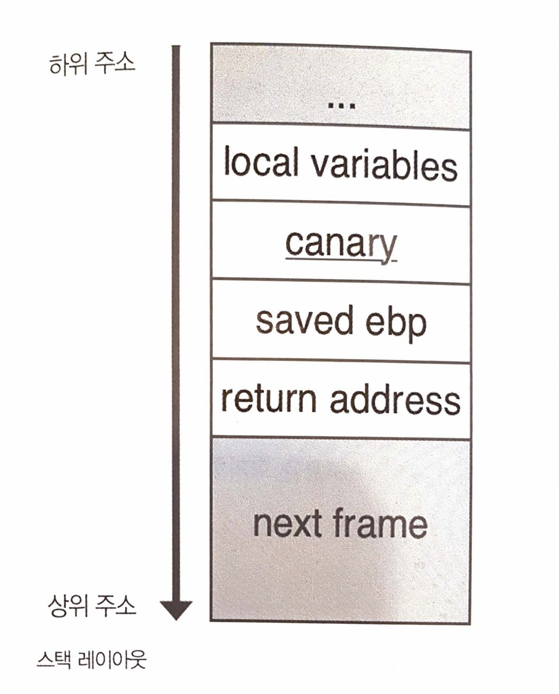
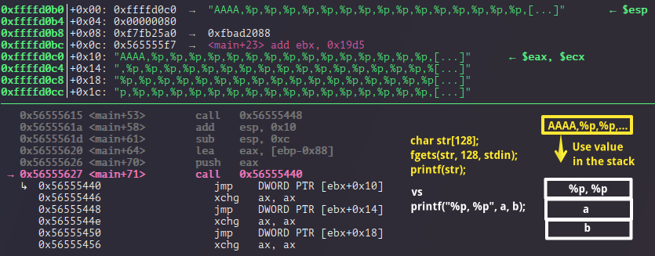
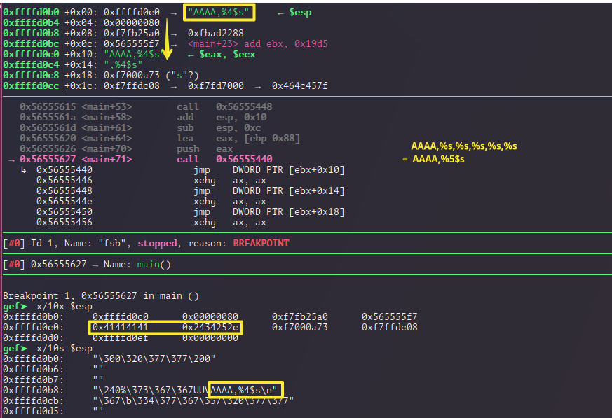

footer: © 2O2L2H Book/Seminar, 2017
slidenumbers: true

# [fit] Chap2. PWN

---
# [fit] Threat Mitigation

---
# `checksec`

```
pwndbg> checksec
[*] '/.../ctf/2017/hu37_hf2017/pwnable/rr2l/Pwnable_RR2L/attackme'
    Arch:     i386-32-little
    RELRO:    Partial RELRO
    Stack:    No canary found
    NX:       NX enabled
    PIE:      No PIE (0x8048000)

gef> checksec
[+] checksec for '/.../ctf/2017/hu37_hf2017/pwnable/shallwedance/shellwedance'
Canary                        : Yes
NX                            : Yes
PIE                           : Yes
Fortify                       : No
RelRO                         : Full
```


---
# NX bit

- No eXecute bit
- DEP (Data Executin Prevention) @windows
- 메모리 상에서 실행될 필요가 없는 데이터를 실행 불가능하도록 설정. shellCode 가 stack 에서 실행 불가.

```bash
$ gcc ... -z execstack
```

---
# [fit] ASLR (Address Space Layout Randomization)

- 스택, 힙, 공유 라이브러리 등을 메모리에 적재할 때 주소의 일부를 랜덤화
- **Code 영역 포함되지 않음.**
- Host 에 설정하는 것으로 바이너리 만으로 확인 불가.

```bash
# Disable
$ sudo sysctl -w kernel.randomize_va_space=0
# Enable
$ sudo sysctl -w kernel.randomize_va_space=2
```


---
# [fit] Stack Smash Protection (a.k.a Canary)

- 스택 프레임의 **로컬 변수 영역과 Saved EBP 사이에 Canary** 라는 값을 넣어서 함수가 종료가 될 때 그 값이 다시 써졌는지 여부를 판별
- 난수 사용. `0xXXXXXX00` (little-endian) 맨 앞자리가 NULL 바이트가 되는 값으로 설정.
    - 로컬 변수에 할당한 문자열이 NULL 바이트로 끝나지 않았을 때 문자열 출력으로 카나리가 유출되는 것을 방지하는 효과 

```bash
$ gcc ... -fno-stack-protector
```



---
# [fit] RELRO (RELocation ReadOnly)

- 메모리에 배치된 데이터의 어느 부분에 대해 Read Only 속성 부여할 것인지를 결정.

- `No RELRO` : GOT writable
- `Partial RELRO(Lazy)` : GOT writable
- `Full RELRO(now)` : GOT readonly
    - 프로그램 시작 할 때 라이브러리 주소를 모두 캐시한 이후에 GOT 영역을 read only 변

---
# [fit] PIE (Position Independent Executable)

- 실행 코드 내의 주소 참조를 모두 상대 주소로 만들어서 실행 파일이 메모리의 어느 위치에 위치하더라도 성공적으로 실행될 수 있게 컴파일된 실행 파일
- ASLR 로는 할 수 없는 실행 파일의 위치 주소를 무작위로 만들 수 있음.
- Exploit 시 이미 알려진 주소가 전혀 없기 때문에 **기본적으로 주소 누수로부터 공격을 시작**

---
# [fit] Format String Bug

---

```c
#include <stdio.h>
int secret = 0x12345678;

int main(int argc, char *argv[])
{
  char str[128];

  fgets(str, 128, stdin);
  printf(str);

  printf("secret = 0x%x\n", secret);
  return 0;
}
```

---



```
AAAA,0x80,0xf7fb25a0,0x565555f7,0x41414141,0x2c70252c,0x252c7025,0x70252c70,...
```

---



---
# Read

#### `AAAA%p%p%p%p%p` => `AAAA,0x80,0xf7fb25a0,0x565555f7,0x41414141,0x2c70252c,`
#### `AAAA%4$p` => `n$` = `X n`
#### `AAAA%4$s`

---

# Write

#### `AAAA%4$n` : 그동안 write 했던 byte size 를 그 주소에 write

- 32byte 주소를 한 번에 적으려면 **그 주소 길이**만큼 write 해야함 ?
- `%n` : 4 bytes
- `%hn` : 2 bytes
- `%hhn` : 1 bytes

---

```c
#include <stdio.h>
#include <string.h>

int main(int argc, char *argv[])
{
  char str[128];

  fgets(str, 128, stdin);
  printf(str);

  fgets(str, 128, stdin);
  printf("%d\n", strlen(str));

  return 0;
}
```

---

`AAAA%4$n`  : 네번째 출력 

```
pwndbg> r
Starting program: /.../chap.02/format_string/got

AAAA,%8p,%8p,%8p,%8p,%8p,%8p,%8p,%8p,%8p,...

AAAA,    0x80,0xf7fb25a0,0xf7e8d9ab,0x41414141,0x7038252c,0x7038252c,...
```

- `strlen_got` 에 `system_addr` 로 write

```
pwndbg> p system
$1 = {<text variable, no debug info>} 0xf7e37060 <__libc_system>

pwndbg> x/10i 0x8048370
   0x8048370 <strlen@plt>:      jmp    DWORD PTR ds:0x804a014
```


